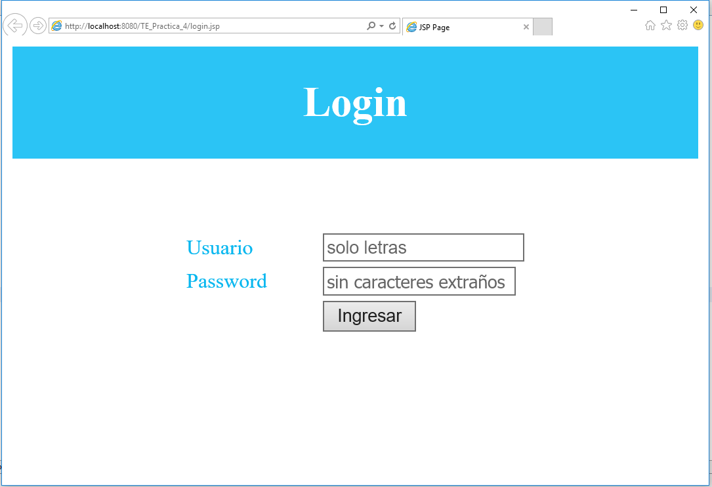
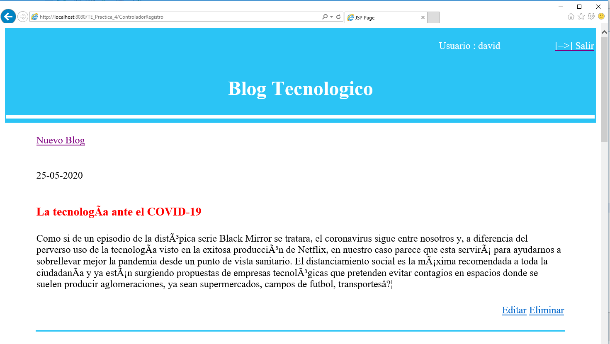
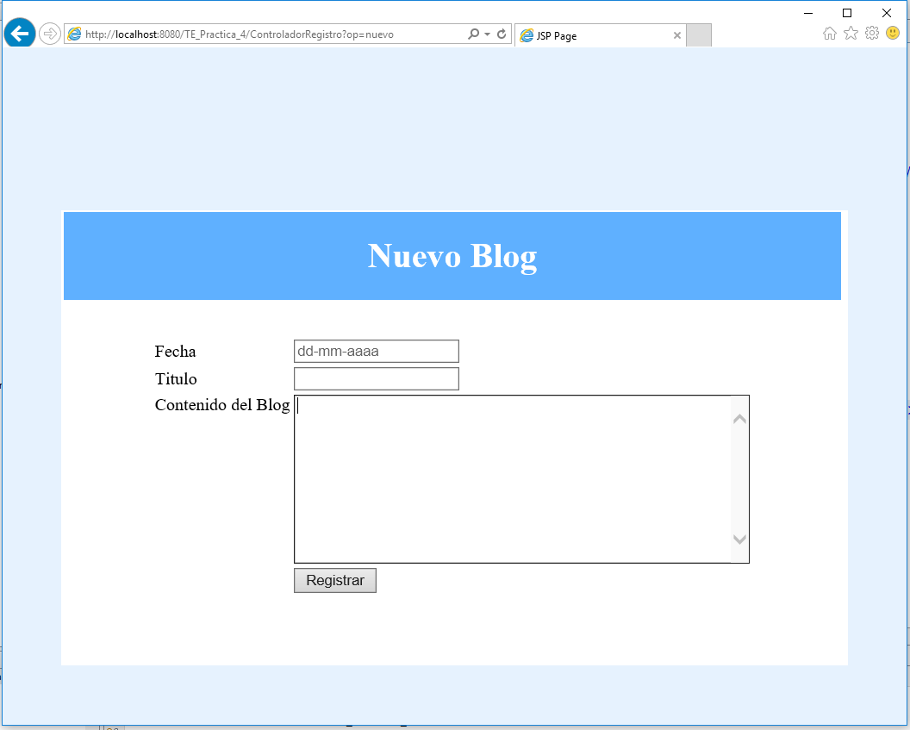
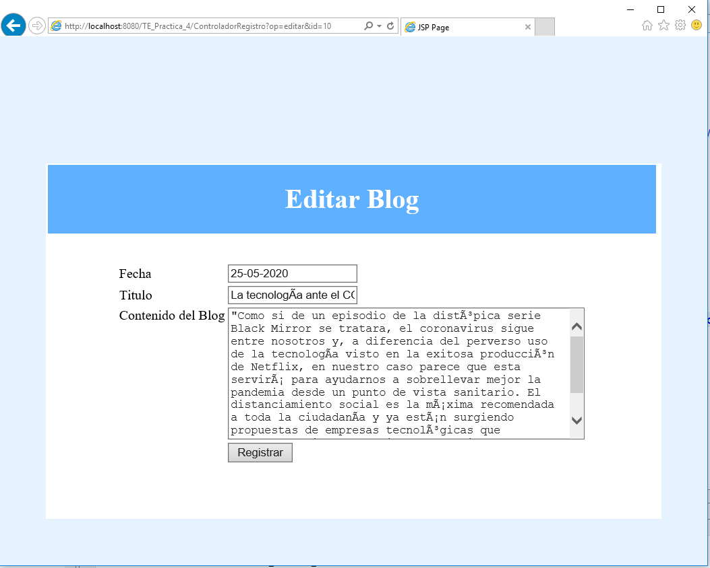

# Creacion de un Login con base de datos
## Ventana Login

## Ventana Inicio

## Ventana Nuevo blog

## Ventana Editar blog

## Base de datos bd_blog
### Usuario = david
### password = user

[Ir ala base de datos](Base20%de20%Datos/bd)
